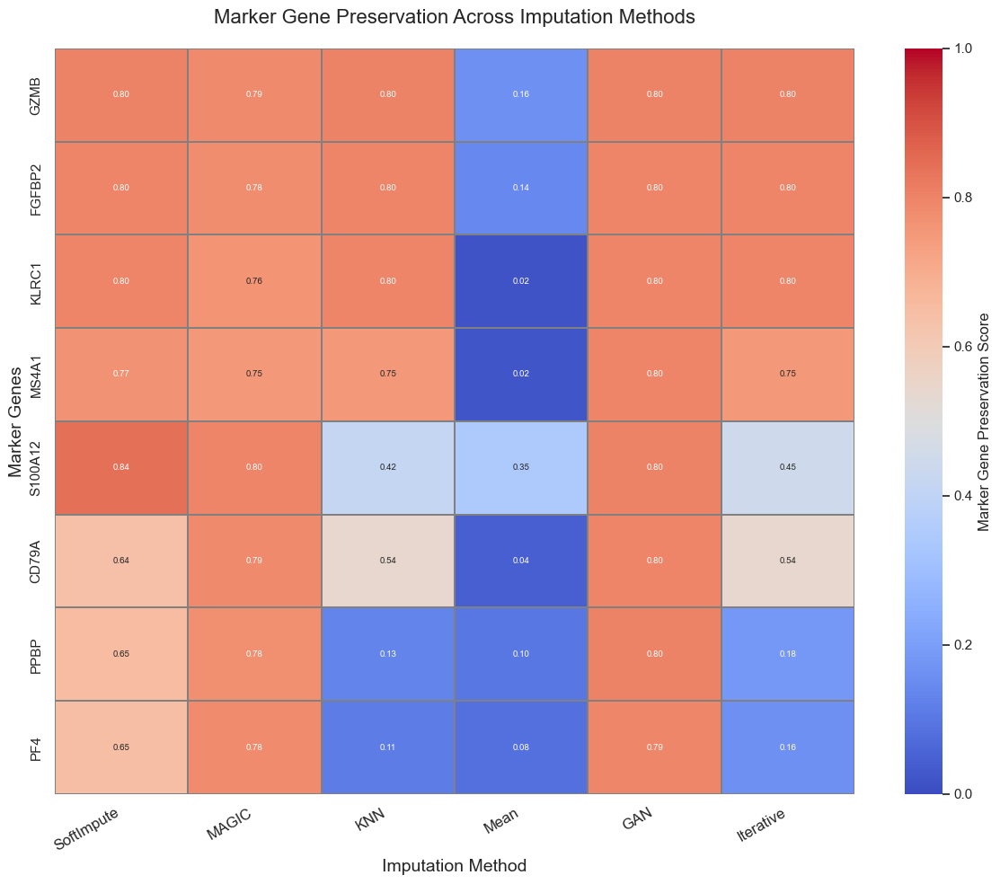
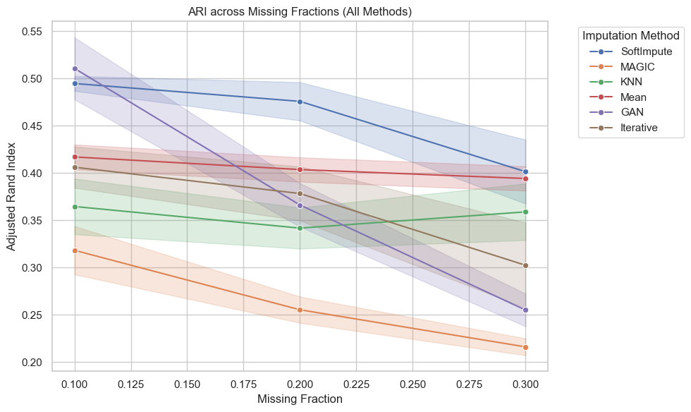
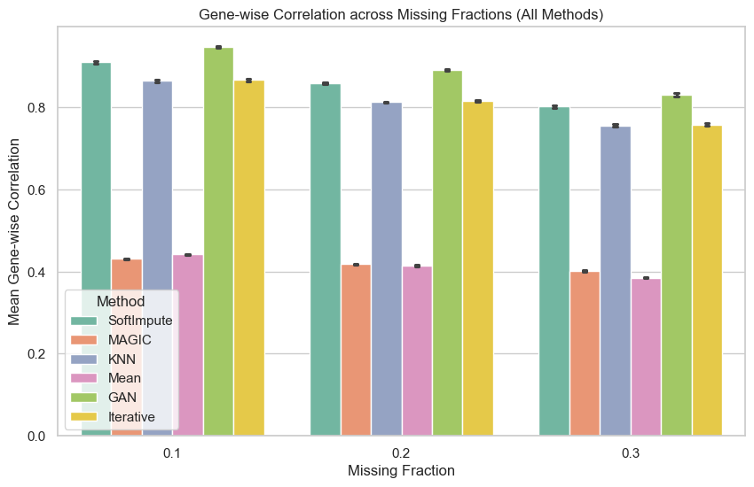
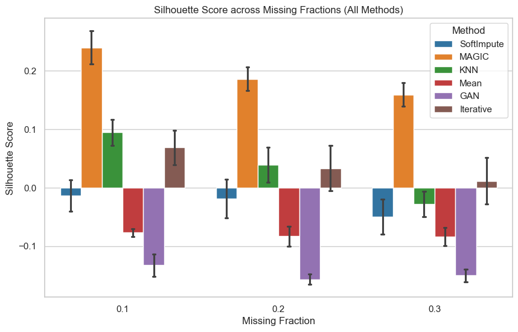

# Benchmarking Imputation Methods for Single-Cell RNA Sequencing Data Using Peripheral Blood Mononuclear Cells from Acute Myocardial Infarction Patients

<p align="left">
  
  
  
  
  
  
</p>

Code and data-processing pipeline accompanying the manuscript:

> **Ramesh, P.** and **Fyta, M.** *Benchmarking Imputation Methods for Single-Cell RNA Sequencing Data Using Peripheral Blood Mononuclear Cells from Acute Myocardial Infarction Patients.* (Preprint, 2026).

A systematic benchmark of six statistical, graph-based, matrix-completion, and deep-learning imputation methods on scRNA-seq data from peripheral blood mononuclear cells (PBMCs) of acute myocardial infarction (AMI) patients, evaluating each method's ability to recover biologically meaningful gene expression under simulated dropout.

---

## Table of Contents

- [Overview](#overview)
- [Dataset](#dataset)
- [Methods Benchmarked](#methods-benchmarked)
- [Evaluation Metrics](#evaluation-metrics)
- [Repository Structure](#repository-structure)
- [Installation](#installation)
- [Reproducing the Analysis](#reproducing-the-analysis)
- [Results](#results)
- [Key Findings](#key-findings)
- [Limitations](#limitations)
- [Data and Code Availability](#data-and-code-availability)
- [License](#license)
- [Citation](#citation)
- [Acknowledgements](#acknowledgements)

---

## Overview

Single-cell RNA sequencing (scRNA-seq) suffers from dropout events technical zeros that mask true gene expression and complicate downstream analyses such as clustering, differential expression, and trajectory inference. While imputation methods have been benchmarked extensively in generic scRNA-seq contexts, their behavior on disease-specific datasets remains understudied.

This repository benchmarks six imputation strategies — **MAGIC**, **IterativeImputer**, **KNNImputer**, **Mean Imputation**, **SoftImpute**, and a **GAN-based** approach on a publicly available scRNA-seq dataset of PBMCs from AMI patients. Artificial missingness is introduced at three levels (10%, 20%, 30%) under a Missing Completely at Random (MCAR) framework, repeated across 10 independent runs per condition, and each method's recovery is scored against the unmasked ground truth across four complementary metrics.

## Dataset

- **Source:** NCBI Gene Expression Omnibus (GEO), accession [**GSE269269**](https://www.ncbi.nlm.nih.gov/geo/query/acc.cgi?acc=GSE269269) — *Single-Cell RNA Sequencing of Peripheral Blood Mononuclear Cells from Acute Myocardial Infarction* (Qian et al., *Front Immunol* 2022).
- **Composition:** ~82,550 single cells from 10 AMI patients (5 plaque-rupture, 5 non-rupture), profiled on the 10x Genomics Chromium platform.
- **Role in this study:** used as the ground-truth reference matrix against which all simulated-dropout / imputed datasets are compared.
- **Preprocessing:** standard Scanpy QC — cells with <200 detected genes or >5% mitochondrial reads excluded; genes detected in <3 cells excluded; log-normalization; top 2,000 highly variable genes (HVGs) retained for downstream analysis (see `notebooks/02_ground_truth_qc.ipynb`).

## Methods Benchmarked

| Method | Category | Description |
|---|---|---|
| **MAGIC** | Graph-based | Diffusion-based denoising using a Markov affinity graph (van Dijk et al., 2018) |
| **IterativeImputer** | Statistical / ML | Round-robin multivariate feature regression |
| **KNNImputer** | Statistical | Nearest-neighbor value filling |
| **Mean Imputation** | Baseline | Gene-wise average replacement |
| **SoftImpute** | Matrix completion | Low-rank approximation via iterative soft-thresholded SVD (Mazumder et al., 2010) |
| **GAN-based Imputation** | Deep learning | Adversarial network-based generative imputation |

## Evaluation Metrics

Each method is scored on four complementary axes, computed across 10 independent masking runs at each of the three missingness levels:

1. **Marker gene preservation** — correlation-based recovery score for canonical immune markers present in the ground truth's HVG feature set.
2. **Clustering consistency (ARI)** — Adjusted Rand Index between Leiden clusters from imputed vs. ground truth data.
3. **Gene-wise correlation** — mean Pearson correlation per gene between imputed and ground truth expression, averaged genome-wide.
4. **Structural separation (silhouette score)** — cluster separation in the low-dimensional PCA embedding (interpreted cautiously, as over-smoothing can inflate this metric independent of true recovery).

## Repository Structure

```
.
├── README.md
├── LICENSE
├── requirements.txt
├── environment.yml
│
├── data/
│   ├── raw/                     # combined_raw.h5ad (downloaded from GEO)
│   ├── processed/                # adata_raw_qc.h5ad — QC'd, HVG-filtered ground truth
│   └── reference/
│       └── ensembl_gene_symbols.txt
│
├── notebooks/
│   ├── 01_data_download.ipynb
│   ├── 02_ground_truth_qc.ipynb
│   ├── 03_dropout_simulation.ipynb
│   ├── 04a_imputation_magic.ipynb
│   ├── 04b_imputation_mean_knn_iterative_softimpute.ipynb
│   ├── 04c_imputation_gan.ipynb
│   ├── 05a_evaluation_marker_genes.ipynb      # → Figure 1
│   ├── 05b_evaluation_ari.ipynb               # → Figure 2
│   ├── 05c_evaluation_gene_correlation.ipynb  # → Figure 3
│   └── 05d_evaluation_silhouette.ipynb        # → Figure 4
│
└── results/
    ├── csv/
    │   ├── evaluation_marker_genes.csv
    │   └── marker_gene_preservation.csv
    └── figures/
        ├── figure1_marker_gene_heatmap.png
        ├── figure2_ari_lineplot.png
        ├── figure3_gene_correlation.png
        └── figure4_silhouette.png
```

## Installation

```bash
# Clone the repository
git clone https://github.com/Prathiksha-Ramesh/Benchmarking-Imputation-Methods-in-Single-cell-RNA-Seq-of-PBMCs-from-Acute-Myocardial-Infarction.git
cd Benchmarking-Imputation-Methods-in-Single-cell-RNA-Seq-of-PBMCs-from-Acute-Myocardial-Infarction

# Create environment
python -m venv venv
source venv/bin/activate      # Windows: venv\Scripts\activate
pip install -r requirements.txt
```

All analyses were run in **Python 3.10** on Linux with conda-based environment management, using compute resources provided by the NHR Center NHR4CES at RWTH Aachen University.

## Reproducing the Analysis

Run the notebooks in numerical order:

| Step | Notebook | Purpose |
|---|---|---|
| 1 | `01_data_download.ipynb` | Download and stage the raw GEO dataset |
| 2 | `02_ground_truth_qc.ipynb` | QC, normalization, HVG selection on the ground truth |
| 3 | `03_dropout_simulation.ipynb` | Simulate MCAR dropout at 10%/20%/30%, 10 runs each |
| 4 | `04a`–`04c` | Run each imputation method on every simulated dataset |
| 5 | `05a`–`05d` | Compute all four metrics and generate Figures 1–4 |

Each evaluation notebook (`05a`–`05d`) independently loads the relevant imputed `.h5ad` files and the ground truth, computes its metric(s), and reproduces the corresponding manuscript figure.

## Results

| Figure | Description |
|---|---|
|  | **Figure 1.** Marker gene preservation across imputation methods. |
|  | **Figure 2.** Adjusted Rand Index (clustering consistency) across missing fractions. |
|  | **Figure 3.** Mean gene-wise correlation with ground truth across missing fractions. |
|  | **Figure 4.** Silhouette scores (structural separation) across missing fractions. |

## Key Findings

- **No single method dominated across all metrics.**
- **GAN** achieved the strongest global transcriptional recovery (gene-wise correlation >0.80), making it best suited for transcriptome-wide trend detection.
- **SoftImpute** delivered the most stable clustering fidelity (ARI >0.40 even at 30% dropout), making it preferable when cell-type identity preservation is the priority.
- **Mean** and **KNN** imputation performed poorly across nearly all benchmarks, risking distortion of platelet, B-cell, NK-cell, and monocyte marker signatures.
- **MAGIC** produced misleadingly high silhouette scores despite weak ARI and correlation performance — a cautionary example of structural clarity in low-dimensional embeddings not implying genuine biological recovery.

## Limitations

- Artificial missingness was simulated under an MCAR assumption, which may not reflect expression-dependent dropout patterns seen in real scRNA-seq data.
- Benchmarking was performed on a single dataset from a single patient cohort; generalizability to other tissues, diseases, or platforms is untested.
- Marker gene evaluation was restricted to genes retained in the ground truth's top-2,000 HVG feature set; several canonical markers (e.g., T-cell markers CD3D/E/G, CD4, CD8A/B, and CD14 for classical monocytes) fell outside this feature space and were not assessed.
- Trajectory inference and cell–cell communication analyses were not evaluated and may respond differently to imputation choice.

See the manuscript's *Limitations* section for full discussion.

## Data and Code Availability

- **Dataset:** GEO accession [GSE269269](https://www.ncbi.nlm.nih.gov/geo/query/acc.cgi?acc=GSE269269)
- **Code:** this repository
- **Preprint:** [link to be added upon posting]

## License

This project is licensed under the [MIT License](LICENSE).

## Citation

If you use this benchmark or code in your research, please cite:

```bibtex
@article{ramesh2026imputationbenchmark,
  author  = {Ramesh, Prathiksha and Fyta, Maria},
  title   = {Benchmarking Imputation Methods for Single-Cell RNA Sequencing Data Using Peripheral Blood Mononuclear Cells from Acute Myocardial Infarction Patients},
  year    = {2026},
  journal = {Preprint},
  url     = {https://github.com/Prathiksha-Ramesh/Benchmarking-Imputation-Methods-in-Single-cell-RNA-Seq-of-PBMCs-from-Acute-Myocardial-Infarction}
}
```

## Acknowledgements

PR is grateful to Prof. Sharmistha Majumdar, Associate Professor, Department of Biological Engineering, Indian Institute of Technology Gandhinagar, for supporting this work. The authors gratefully acknowledge computing time provided by the NHR Center NHR4CES at RWTH Aachen University, funded by the Federal Ministry of Education and Research and the participating state governments under the GWK resolutions for national high-performance computing at universities.

PR was supported by the DAAD KOSPIE Scholarship to conduct her master's thesis research at RWTH Aachen University in collaboration with IIT Gandhinagar.

---

**Affiliations**
1. Department of Biological Sciences and Engineering, Indian Institute of Technology Gandhinagar, Gujarat, India
2. Computational Biotechnology, RWTH Aachen University, Worringerweg 3, 52074 Aachen, Germany
3. Center for Computational Life Sciences (CCLS), RWTH Aachen University, Pauwelstrasse 19, 52074 Aachen, Germany

**Corresponding author:** Prathiksha Ramesh
